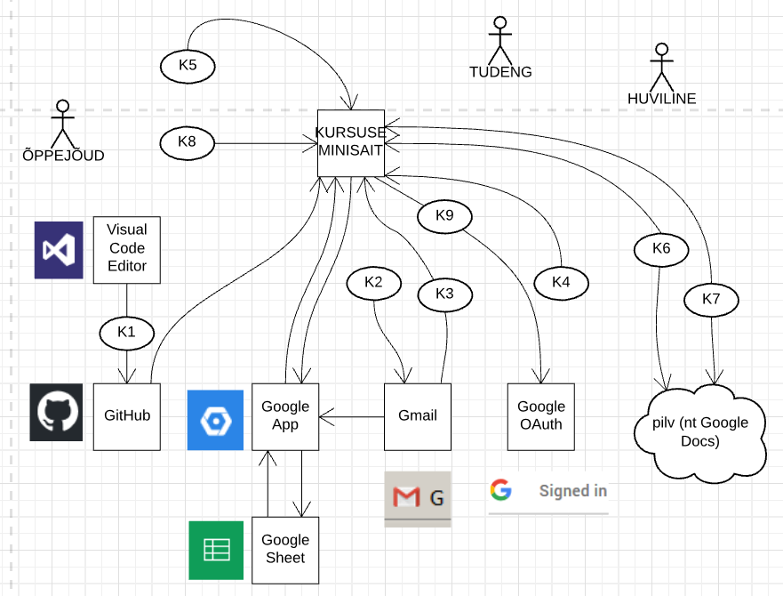

# Kursuse minisait
{: .no_toc}

- TOC
{:toc}

## Mõisted

`TÖÖ`, 1-4 liikmelise rühma poolt tehtav, kirjalikult õppejõu e-postkasti esitatav ja rühma ühe liikme poolt praktikumis ettekantav iseseisev harjutustöö. Igal nädalal tehakse üks töö (kokku 12 tööd).

`TUDENG`, kursusele registreerunud tudeng. Omab Gmaili kontot.

`ÕPPEJÕUD`, kursust õpetav õppejõud. Omab Gmaili kontot.

`KURSUSE MINISAIT`, veebirakendus, mis mis pakub kogu kursuse teavet ja toetab mitmesuguseid toiminguid (nendest allpool, kasutuslugudes), piirates seejuures vajalikul määral juurdepääsu teabele ja toimingutele.

`HUVILINE`, potentsiaalne või endine tudeng või ükstapuha kes kursuse avalike materjalide vastu huvi tunneb.

`RÜHM`, kursusele registreerunud TUDENGIte kogum.

`ÕPPEMATERJAL`, loengutekstid, juhendid, koodinäited, kalender jm õppejõu poolt väljapandav tekstiline ja ka graafiline õppeteave.

## Kasutuslood

`K1 materjalide ülespanemine` - ÕPPEJÕUD koostab loenguteksti, juhendi vm õppematerjali ja paneb KURSUSE MINISAIDILE üles (ülespanek  automatiseeritud).

`K2 töö esitamine` - TUDENG (töörühma üks liikmetest) saadab kirjaliku TÖÖ õppejõu Gmaili aadressile.

`K3 töö ettekandmine` - PRAKTIKUMIS TUDENG avab PROJEKTORiga ühendatud ÕPPEJÕUARVUTIs ÕPPEJÕU postkastis oma TÖÖ ja tutvustab seda RÜHMale.

`K4 töö ettekandmise registreerimine` - TUDENG sisestab KURSUSE MINISAIDIL oma nime (see on kiire - typeahead-tehnoloogia), valib töö numbri ja märgib ettekandmise tehtuks.

`K5 edenemise jälgimine` - RÜHMA liige või ÕPPEJÕUD, autenditult, vaatavad tabelit esitatud ja ettekantud tööde kohta (jooksvalt kujunevat hinnet).

`K6 töö avamine` - TUDENG saab avada oma töö tutvumiseks teistele RÜHMA liikmetele. Selleks ta paneb oma töö pilve (nt Google Docs) ja annab KURSUSE MINISAIDIL teada töö aadressi.

`K7 teiste töödega tutvumine` - RÜHMA liige saab tutvuda tutvumiseks avatud töödega.

`K8 kommenteerimine` - RÜHMA liige saab kommenteerida tutvumiseks avatud teise TUDENGI tööd. ÕPPEJÕUD saab kommenteerida kõiki töid.

`K9 autentimine` - TUDENG ja ÕPPEJÕUD saavad KURSUSE MINISAIDILE sisse logida.

## Arhitektuurijoonis

